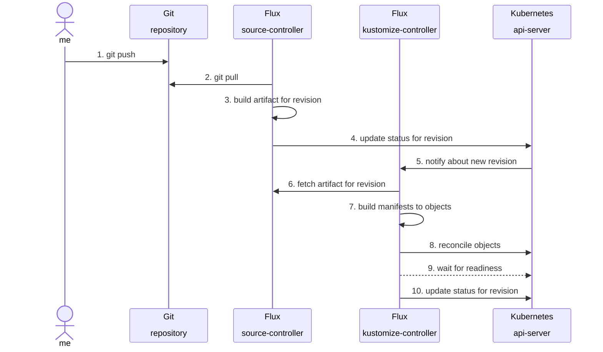

# keos-system-services

> [!NOTE]
> This repository is based on the `d1` reference architecture for the
> [ControlPlane Enterprise for Flux CD](https://github.com/controlplaneio-fluxcd/distribution/blob/main/guides/ControlPlane_Flux_D1_Reference_Architecture_Guide.pdf).

## Scope and Access Control

This repository is managed by the Platform team who are responsible for the Kubernetes system services.

This repository is used to define the Kubernetes system services components such as:

- Clusterwide configuration
- Storage componentes
- Observability components
- Stratio core applications such as Gosec, Command Center...

This repository is reconciled on the cluster fleet by Flux as the **cluster admin**. Access to this repository is restricted to the Platform team and the
[Flux bot account](https://github.com/forselli-stratio/keos-fleet-test?tab=readme-ov-file#github-account-for-flux).

## Repository Structure

This repository contains the following directories:

- The **components** dir contains Flux HelmReleases for cluster system-services with custom configuration per use case.

A cluster component is defined in a directory with the following structure:

```sh
component/
└── configs # Custom Resources of controllers
    ├── base # common definitions
    ├── production # production specific values
    └── staging # staging specific values
```

## Continuous Delivery

Changes to the `main` branch are automatically reconciled by Flux on the staging cluster.



After the changes are reconciled on staging, the platform team can promote the changes to the production clusters by merging the `main` branch into the `production` branch.
